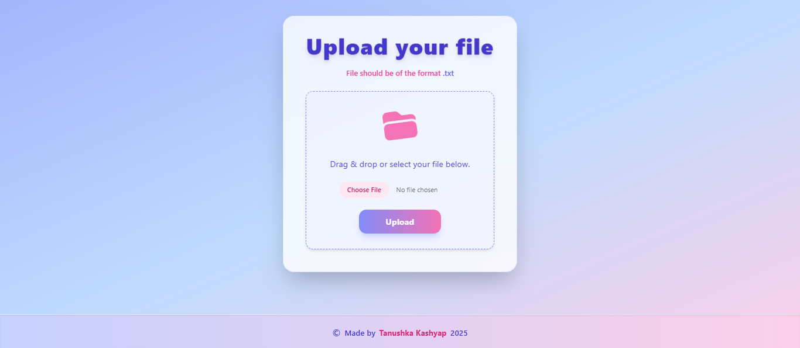

# Welcome to Log Parser! 👋


## About

> A log parser application with a backend built using Node.js and TypeScript that converts a log file in a specific format to a JSON file. The log file format includes a timestamp, log level, transaction ID, and log information. The frontend, built using React and Tailwind CSS, provides a UI for uploading the log file and downloading the parsed JSON file. The UI includes a button for uploading the file and an alert to show API error messages. The build tool used is Vite.

## Live Demo

Check out the live project here:  
[Log Parser Live](https://log-parser-nodejs-dgqv73ohq-tanushka-kashyaps-projects.vercel.app/)


## Screenshots



## Run Locally

Clone the project

```bash
  git clone https://github.com/Tanukash12/Log-Parser-Nodejs
```

Go to the project directory

Navigate to client

```bash
  cd client
```

Install dependencies

```bash
  npm install
```
Run application

```bash
  npm run dev
```

Navigate to server

```bash
  cd server
```
Install dependencies

```bash
  npm install
```
Run application

```bash
  npm run dev
```

Start the server

```bash
  npm run start
```


## Authors

- [@Tanukash12](https://github.com/Tanukash12)


## Features or Limitations

- Uploads file using API.
- Download JSON file received from API response.
- Shows loader while API is being called.
- Automatically downloads JSON file after successful API response.
- Parses log messages with log levels error and warn.
- Returns parsed output as JSON response.
- Flexible architecture, easy to extend and modify.


## API Reference

#### Parse to json

```http
  POST /api/logs/logParser/fileName
```

| Parameter | Type     | Description                       |
| :-------- | :------- | :-------------------------------- |
| `body`      | `file` | **Required** file containing the text to be parsed |


